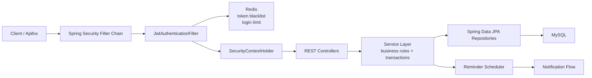
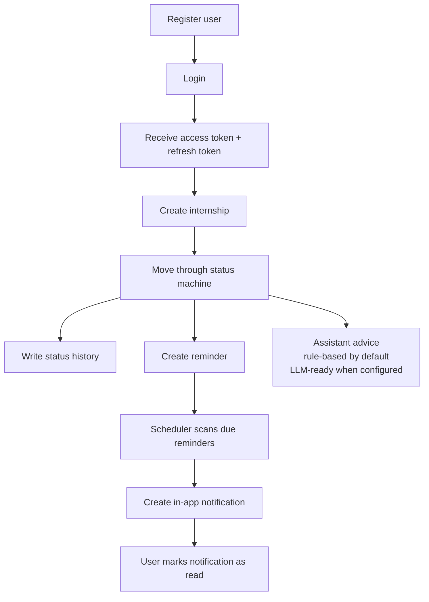
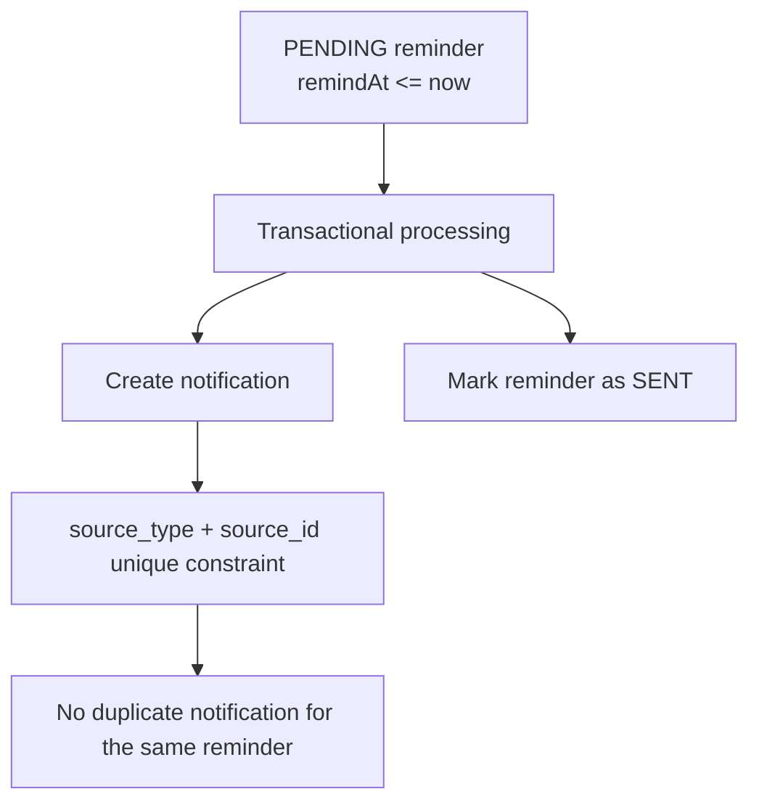
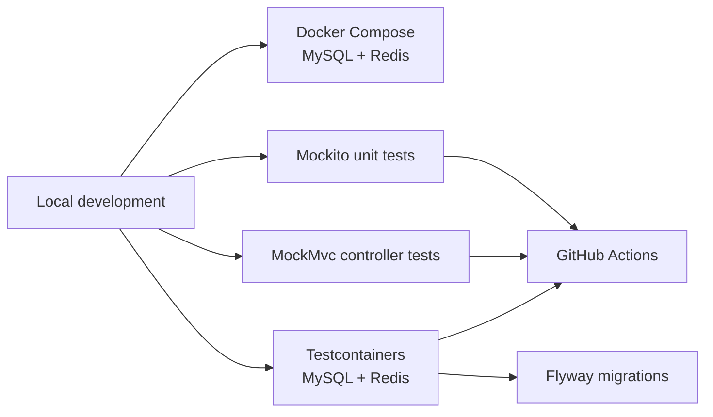

# Internship Application Management & AI Assistant

A Spring Boot backend for managing the internship application workflow.

The project is not just a CRUD tracker. It models a real job-search process: user authentication, role-based access control, user data isolation, internship applications, status transitions, status history, reminders, in-app notifications, Redis-backed security hardening, and assistant advice.

## Project Positioning

This project is designed as an interview-ready Java backend project:

- It has a clear business domain: internship application workflow management.
- It includes security and authorization concerns that are common in real systems.
- It has business rules beyond CRUD, especially the status machine and reminder-to-notification flow.
- It is reproducible with Docker Compose, Flyway, Testcontainers, and GitHub Actions.
- It has a README and regression test assets that explain how to run, test, and discuss the project.

One-sentence introduction:

> A Spring Boot based internship application workflow system with JWT authentication, RBAC, user data isolation, status tracking, reminders, notifications, Redis-backed security hardening, and an AI-assistant-ready advice module.

## Interview-Ready Scope

The current version is the recommended interview baseline. The goal is not to keep adding unrelated features, but to keep the system stable, testable, and explainable.

Completed core capabilities:

1. JWT authentication and refresh-token based session renewal
2. Lightweight RBAC with `USER` and `ADMIN`
3. Current-user data isolation
4. Internship CRUD with pagination, filtering, keyword search, and sorting
5. Backend-owned internship status machine
6. Internship status change history
7. Reminder system
8. In-app notification flow generated from due reminders
9. Redis login rate limiting and JWT access-token blacklist
10. Rule-based AI Assistant with optional LLM-ready provider abstraction
11. Flyway migrations, Testcontainers integration tests, GitHub Actions CI, and Docker Compose local infrastructure

Recommended interview focus:

- Explain the JWT authentication chain and why the JWT subject is `userId`.
- Explain how RBAC turns `USER` / `ADMIN` into Spring Security authorities.
- Explain why Redis is used for security state instead of ordinary caching first.
- Explain why a status machine and status history are stronger than a plain `status` field.
- Explain how Testcontainers, GitHub Actions, Flyway, and Docker Compose make the project reproducible.

## Tech Stack

- Java 17
- Spring Boot
- Spring Web MVC
- Spring Security
- Spring Data JPA
- Spring Data Redis
- MySQL
- Redis
- JWT with `jjwt`
- Bean Validation
- Maven
- Apifox regression tests
- Testcontainers MySQL and Redis integration tests

## Core Modules

| Module | Purpose |
| --- | --- |
| Authentication | Register, login, JWT access token, refresh token, logout |
| Authorization | Current-user APIs, user-scoped internships, lightweight `USER` / `ADMIN` RBAC |
| Security hardening | Redis access-token blacklist and Redis login failure rate limiting |
| Internship workflow | CRUD, pagination, filtering, search, sorting, `updatedAt` |
| Status machine | Backend-owned legal status transitions |
| Status history | Audit-style timeline for status changes |
| Reminders | User-scoped reminders for OA, interview, offer deadline, and follow-up tasks |
| Notifications | In-app notification records generated from due reminders |
| Assistant | Rule-based advice generated from status, timestamps, and reminder data, with optional LLM enhancement |
| Engineering | Flyway migrations, Docker Compose, Testcontainers, Apifox regression tests, GitHub Actions CI |

## High-Level Architecture



The controller layer does not trust user ids from the request body or URL. User identity comes from the authenticated JWT subject and `SecurityContextHolder`.

## Business Workflow



## Reminder-To-Notification Flow



The notification flow is intentionally lightweight. Email delivery, WebSocket push, and MQ-based retries are future extensions rather than part of the interview-ready baseline.

## Testing And Delivery Pipeline



The project uses different tools for different confidence levels:

- Mockito tests verify service logic quickly.
- MockMvc tests verify API response shape and exception mapping.
- Testcontainers verifies the real Spring Boot + MySQL + Redis + Flyway + Security chain.
- Apifox verifies the API from a client user's point of view.

## Authentication Flow

1. User registers with username, email, and password.
2. Backend validates duplicate username/email.
3. Backend hashes the password with BCrypt.
4. User logs in with username and password.
5. Backend validates the password with `passwordEncoder.matches(...)`.
6. Backend generates an access JWT with `userId` as the subject.
7. Backend generates a random refresh token.
8. Backend stores only the SHA-256 hash of the refresh token.
9. Frontend stores the access token and refresh token.
10. Frontend sends protected requests with:

```http
Authorization: Bearer <token>
```

11. `JwtAuthenticationFilter` parses and validates the access token.
12. The filter loads the user role and converts it into a Spring Security authority such as `ROLE_USER` or `ROLE_ADMIN`.
13. The filter creates an `Authentication` object and writes it into `SecurityContextHolder`.
14. Controllers read the authenticated user from `Authentication`, not from request body or URL parameters.

When the access token expires, the frontend can call:

```http
POST /api/users/refresh-token
```

with the refresh token to receive a new access token.

Logout calls:

```http
POST /api/users/logout
Authorization: Bearer <access-token>
```

and deletes the stored refresh token hash. If the request includes the current `Authorization` header, the backend also stores a hash of the access token in Redis until the token's original expiration time. That gives this otherwise stateless JWT an active logout mechanism.

Login failures are also tracked in Redis. After too many failed attempts for the same username within the configured window, the login endpoint returns `429 Too Many Requests`.

## API Overview

### Health

| Method | Endpoint | Description | Auth |
| --- | --- | --- | --- |
| GET | `/api/health` | Check whether the app is running | No |

### Users

| Method | Endpoint | Description | Auth |
| --- | --- | --- | --- |
| POST | `/api/users` | Register user | No |
| POST | `/api/users/login` | Login and receive access/refresh tokens | No |
| POST | `/api/users/refresh-token` | Use refresh token to receive a new access token | No |
| POST | `/api/users/logout` | Delete refresh token and blacklist current access token when provided | No |
| GET | `/api/users/me` | Get current user | Yes |
| PUT | `/api/users/me` | Update current user's username/email | Yes |
| PUT | `/api/users/me/password` | Update current user's password | Yes |
| DELETE | `/api/users/me` | Delete current user | Yes |

### Admin

| Method | Endpoint | Description | Auth |
| --- | --- | --- | --- |
| GET | `/api/admin/users` | Get all users | ADMIN |

This project currently uses a lightweight RBAC model:

```text
users.role = USER | ADMIN
```

New registrations default to `USER`. To create an admin account in local development, update the role directly in the database:

```sql
UPDATE users SET role = 'ADMIN' WHERE username = 'your_admin_username';
```

For this project size, a single `role` column is enough. If roles and permissions become more complex later, this can evolve into separate `roles`, `permissions`, and `user_roles` tables.

### Internships

| Method | Endpoint | Description | Auth |
| --- | --- | --- | --- |
| GET | `/api/internships` | Get current user's internships with pagination/filter/search/sort | Yes |
| GET | `/api/internships/{id}` | Get current user's internship by id | Yes |
| POST | `/api/internships` | Create internship for current user | Yes |
| PUT | `/api/internships/{id}` | Update current user's internship | Yes |
| GET | `/api/internships/{id}/status-history` | Get current user's internship status timeline | Yes |
| DELETE | `/api/internships/{id}` | Delete current user's internship | Yes |

`GET /api/internships` supports:

| Query Parameter | Description | Example |
| --- | --- | --- |
| `page` | Zero-based page number. Negative values are treated as `0`. | `0` |
| `size` | Page size. Values below `1` become `1`; values above `100` become `100`. | `10` |
| `status` | Optional internship status filter. Invalid enum values return `400`. | `APPLIED` |
| `keyword` | Optional search keyword for company or position. Blank values are treated as no search. | `google` |
| `sort` | Sort field and direction. Invalid sort fields fall back to `createdAt`. | `updatedAt,desc` |

Allowed sort fields:

- `createdAt`
- `updatedAt`
- `company`
- `position`
- `status`

Allowed sort directions:

- `asc`
- `desc`

Any direction other than `asc` is treated as `desc`.

Example:

```http
GET /api/internships?page=0&size=10&status=APPLIED&keyword=backend&sort=updatedAt,desc
Authorization: Bearer <token>
```

### Reminders

| Method | Endpoint | Description | Auth |
| --- | --- | --- | --- |
| GET | `/api/reminders` | Get current user's reminders, optionally filtered by status | Yes |
| POST | `/api/reminders` | Create a reminder for one of the current user's internships | Yes |
| PUT | `/api/reminders/{id}/cancel` | Cancel one of the current user's reminders | Yes |

`GET /api/reminders` supports:

| Query Parameter | Description | Example |
| --- | --- | --- |
| `status` | Optional reminder status filter. Invalid enum values return `400`. | `PENDING` |

Supported reminder statuses:

- `PENDING`
- `SENT`
- `CANCELLED`

Create reminder example:

```http
POST /api/reminders
Authorization: Bearer <token>
Content-Type: application/json
```

```json
{
  "internshipId": 10,
  "message": "OA due tomorrow",
  "remindAt": "2099-01-02T10:00:00"
}
```

The backend verifies that `internshipId` belongs to the current user before creating the reminder. This prevents one user from creating or reading reminders for another user's internship.

Due reminders are processed by a scheduled backend job. The scheduler finds due `PENDING` reminders, creates an in-app notification, and marks the reminder as `SENT` in one transaction.

### Notifications

| Method | Endpoint | Description | Auth |
| --- | --- | --- | --- |
| GET | `/api/notifications` | Get current user's notifications | Yes |
| GET | `/api/notifications?unreadOnly=true` | Get only unread notifications | Yes |
| PUT | `/api/notifications/{id}/read` | Mark one current-user notification as read | Yes |

Notifications are currently generated by due reminders:

```text
PENDING reminder reaches remindAt
-> scheduler processes it
-> notification is created
-> reminder is marked SENT
```

`notifications.source_type + notifications.source_id` has a unique constraint, so the same reminder cannot generate duplicate notifications.

### Assistant

| Method | Endpoint | Description | Auth |
| --- | --- | --- | --- |
| GET | `/api/assistant/internships/{id}/advice` | Generate assistant advice for one of the current user's internships | Yes |

The assistant is deterministic by default. It uses internship status, `updatedAt`, and pending reminder data to generate controlled and testable suggestions.

An optional LLM mode can be enabled through environment variables. When enabled and configured, the service sends the rule-based context to an LLM provider and returns enhanced advice. If the LLM call fails or is not configured, the endpoint falls back to the rule-based response.

Example response:

```json
{
  "code": 200,
  "message": "success",
  "data": {
    "internshipId": 10,
    "status": "TECH_INTERVIEW",
    "source": "RULE_BASED",
    "summary": "You are currently in the technical interview stage.",
    "suggestions": [
      "Prepare a 2-minute project introduction and review Java, Spring Boot, JWT, Redis, MySQL, and transaction questions.",
      "No pending reminder was found for this stage. Add one for the assessment, interview, or offer deadline."
    ]
  }
}
```

### Internship Status Machine

The backend owns internship status transitions. The frontend can request a
status change, but the service layer decides whether the transition is valid.

Supported status values:

- `DRAFT`
- `APPLIED`
- `ONLINE_ASSESSMENT`
- `TECH_INTERVIEW`
- `HR_INTERVIEW`
- `OFFER`
- `REJECTED`
- `WITHDRAWN`

Examples of valid transitions:

- `DRAFT -> APPLIED`
- `APPLIED -> ONLINE_ASSESSMENT`
- `ONLINE_ASSESSMENT -> TECH_INTERVIEW`
- `TECH_INTERVIEW -> HR_INTERVIEW`
- `HR_INTERVIEW -> OFFER`
- Any active progress state can move to `REJECTED` or `WITHDRAWN`

Examples of rejected transitions:

- `DRAFT -> OFFER`
- `REJECTED -> TECH_INTERVIEW`
- `OFFER -> ONLINE_ASSESSMENT`

Invalid transitions return a unified `400` response:

```json
{
  "code": 400,
  "message": "Cannot change internship status from DRAFT to OFFER",
  "data": null
}
```

When a status change succeeds, the backend writes a status history row in the
same transaction as the internship update. Editing other fields without changing
the status does not create a history row.

Status history endpoint:

```http
GET /api/internships/{id}/status-history
Authorization: Bearer <token>
```

Example response:

```json
{
  "code": 200,
  "message": "success",
  "data": [
    {
      "id": 1,
      "internshipId": 10,
      "fromStatus": "APPLIED",
      "toStatus": "ONLINE_ASSESSMENT",
      "operatorUserId": 1,
      "operatorUsername": "ezra",
      "note": "Received OA",
      "createdAt": "2026-06-25T15:46:31"
    }
  ]
}
```

## Response Format

Successful response:

```json
{
  "code": 200,
  "message": "success",
  "data": {}
}
```

Error response:

```json
{
  "code": 401,
  "message": "Unauthorized",
  "data": null
}
```

Paginated internship response:

```json
{
  "code": 200,
  "message": "success",
  "data": {
    "content": [],
    "page": 0,
    "size": 10,
    "totalElements": 0,
    "totalPages": 0,
    "first": true,
    "last": true
  }
}
```

## Security Notes

- Passwords are never returned in API responses.
- Passwords are stored as BCrypt hashes.
- JWT uses `userId` as subject because `username` can change.
- Refresh tokens are generated as random opaque tokens.
- Only refresh token hashes are stored in the database.
- Logout invalidates the refresh token and blacklists the current access token when the request includes `Authorization: Bearer <token>`.
- Login failures are counted in Redis with a TTL to reduce brute-force login attempts.
- Users have a `USER` or `ADMIN` role.
- Admin endpoints require `ROLE_ADMIN`.
- Authenticated non-admin users receive `403 Forbidden` when accessing admin endpoints.
- Protected endpoints do not trust frontend-provided `userId`.
- Internship access uses `findByIdAndUserId(id, currentUserId)` to prevent cross-user access.
- Missing or invalid token returns `401 Unauthorized`.
- Cross-user internship access returns `404 Not Found`.

## Database Design

Database schema is managed by Flyway migrations under:

```text
src/main/resources/db/migration
```

Initial migration:

```text
V1__create_users_and_internships_tables.sql
```

Query enhancement migration:

```text
V2__normalize_internship_status_and_add_query_indexes.sql
```

`V2` normalizes old text status values to uppercase enum values and adds indexes for current-user internship queries by `user_id`, `status`, and `created_at`.

Refresh token migration:

```text
V3__create_refresh_tokens_table.sql
```

`V3` creates `refresh_tokens` with a hashed token value, expiration time, creation time, and `user_id` foreign key.

RBAC migration:

```text
V4__add_user_role.sql
```

`V4` adds `users.role`, defaulting existing and future users to `USER`.

Internship updated timestamp migration:

```text
V5__add_updated_at_to_internships.sql
```

`V5` adds `internships.updated_at` and backfills existing rows from `created_at` or the current timestamp.

Internship status machine migration:

```text
V6__normalize_internship_status_machine.sql
```

`V6` maps old `INTERVIEW` values to `TECH_INTERVIEW` so existing data stays compatible with the expanded status enum.

Internship status history migration:

```text
V7__create_internship_status_history.sql
```

`V7` creates `internship_status_history`, which records each successful status change. History rows are deleted when their internship is deleted, and `operator_user_id` is set to null if the operator user is deleted.

Reminder migration:

```text
V8__create_reminders_table.sql
```

`V8` creates `reminders`, which stores user-scoped reminder records linked to internships. Reminder rows are deleted when the owning user or internship is deleted.

Notification migration:

```text
V9__create_notifications_table.sql
```

`V9` creates `notifications`, which stores current-user in-app notifications. The table includes a unique constraint on `source_type + source_id` to prevent duplicate notification creation for the same source reminder.

Hibernate is configured with `ddl-auto=validate` in dev/test profiles. This means Flyway creates or migrates the schema, and Hibernate validates that the entity mappings match the database.

### users

| Column | Description |
| --- | --- |
| id | Primary key |
| username | Unique username |
| email | Unique email |
| password | BCrypt-hashed password |
| role | User role: `USER` or `ADMIN` |
| created_at | User creation time |

### internships

| Column | Description |
| --- | --- |
| id | Primary key |
| company | Company name |
| position | Internship position |
| location | Location |
| status | Application status |
| application_url | Application link |
| created_at | Creation time |
| updated_at | Last update time |
| user_id | Foreign key to users.id |

### internship_status_history

| Column | Description |
| --- | --- |
| id | Primary key |
| internship_id | Foreign key to internships.id |
| from_status | Previous internship status |
| to_status | New internship status |
| operator_user_id | User who changed the status |
| note | Optional status-change note |
| created_at | Status-change time |

### reminders

| Column | Description |
| --- | --- |
| id | Primary key |
| user_id | Foreign key to users.id |
| internship_id | Foreign key to internships.id |
| message | Reminder message |
| remind_at | Time when the reminder should trigger |
| status | Reminder status: `PENDING`, `SENT`, or `CANCELLED` |
| created_at | Creation time |
| updated_at | Last update time |

### notifications

| Column | Description |
| --- | --- |
| id | Primary key |
| user_id | Foreign key to users.id |
| type | Notification type, currently `REMINDER_DUE` |
| title | Notification title |
| content | Notification content |
| is_read | Whether the user has read the notification |
| source_type | Source type, currently `REMINDER` |
| source_id | Source record id, currently reminder id |
| created_at | Creation time |
| read_at | Time when the notification was marked as read |

## Configuration

The project uses environment variables and Spring profiles so the same code can run in different environments.

Common JWT settings:

| Variable | Description | Default |
| --- | --- | --- |
| `JWT_SECRET` | Secret used to sign JWT tokens | `internship-tracker-dev-secret-key-32bytes` |
| `JWT_EXPIRATION_MS` | Access token expiration time in milliseconds | `3600000` |
| `JWT_REFRESH_EXPIRATION_MS` | Refresh token expiration time in milliseconds | `604800000` |

Redis-backed auth hardening settings:

| Variable | Description | Default |
| --- | --- | --- |
| `REDIS_HOST` | Redis host used by the dev profile | `localhost` |
| `REDIS_PORT` | Redis port used by the dev profile | `6380` |
| `LOGIN_MAX_FAILED_ATTEMPTS` | Failed login attempts allowed inside one window | `5` |
| `LOGIN_RATE_LIMIT_WINDOW_MINUTES` | Login failure counting window in minutes | `15` |

Assistant LLM settings:

| Variable | Description | Default |
| --- | --- | --- |
| `ASSISTANT_LLM_ENABLED` | Enables optional LLM enhancement for assistant advice | `false` |
| `ASSISTANT_LLM_PROVIDER` | LLM provider name currently supported by the client | `openai` |
| `ASSISTANT_LLM_API_KEY` | API key for the LLM provider. Leave empty to force rule-based fallback | empty |
| `ASSISTANT_LLM_MODEL` | Model name used when LLM mode is enabled | `gpt-4.1-mini` |
| `ASSISTANT_LLM_BASE_URL` | OpenAI Responses API endpoint | `https://api.openai.com/v1/responses` |

Development profile database settings:

| Variable | Description | Default |
| --- | --- | --- |
| `DB_URL` | MySQL connection URL | `jdbc:mysql://localhost:3306/internship_tracker...` |
| `DB_USERNAME` | MySQL username | `root` |
| `DB_PASSWORD` | MySQL password | empty |

Test profile database settings:

| Variable | Description | Default |
| --- | --- | --- |
| `TEST_DB_URL` | Test database URL | `jdbc:mysql://localhost:3306/internship_tracker_test...` |
| `TEST_DB_USERNAME` | Test database username | falls back to `DB_USERNAME` |
| `TEST_DB_PASSWORD` | Test database password | falls back to `DB_PASSWORD` |
| `TEST_JWT_SECRET` | Test JWT secret | `test-secret-key-with-at-least-32-bytes` |
| `TEST_JWT_EXPIRATION_MS` | Test access token expiration | `3600000` |
| `TEST_JWT_REFRESH_EXPIRATION_MS` | Test refresh token expiration | `604800000` |

Profiles:

- `dev`: local MySQL development configuration
- `test`: test-focused configuration

## Local Setup

### Option A: Docker Compose MySQL + Redis

Create a local `.env` file:

```bash
cp .env.example .env
```

Start MySQL and Redis:

```bash
docker compose up -d mysql redis
```

This starts a MySQL 8.4 container on local port `3307` and a Redis 7 container on local port `6380` by default:

```text
jdbc:mysql://localhost:3307/internship_tracker?useSSL=false&serverTimezone=UTC&allowPublicKeyRetrieval=true
redis://localhost:6380
```

Load the `.env` variables into the current terminal:

```bash
set -a
source .env
set +a
```

Run the app:

```bash
./mvnw spring-boot:run -Dspring-boot.run.profiles=dev
```

Stop the database:

```bash
docker compose down
```

Remove the local database volume if you want a completely fresh database:

```bash
docker compose down -v
```

### Option B: Existing Local MySQL

Create a MySQL database:

```sql
CREATE DATABASE internship_tracker;
```

Set environment variables:

```bash
export DB_URL='jdbc:mysql://localhost:3306/internship_tracker?useSSL=false&serverTimezone=UTC&allowPublicKeyRetrieval=true'
export DB_USERNAME='root'
export DB_PASSWORD='your_mysql_password'
export JWT_SECRET='replace-with-at-least-32-byte-secret-key'
export JWT_EXPIRATION_MS='3600000'
export JWT_REFRESH_EXPIRATION_MS='604800000'
```

Run the app:

```bash
./mvnw spring-boot:run -Dspring-boot.run.profiles=dev
```

If you run the app from IntelliJ IDEA, put these values in the run configuration's environment variables:

```text
DB_URL=jdbc:mysql://localhost:3307/internship_tracker?useSSL=false&serverTimezone=UTC&allowPublicKeyRetrieval=true;DB_USERNAME=root;DB_PASSWORD=local_dev_password;JWT_SECRET=replace-with-at-least-32-byte-secret-key;JWT_EXPIRATION_MS=3600000;JWT_REFRESH_EXPIRATION_MS=604800000
```

If you are running Redis from Docker Compose, also include:

```text
REDIS_HOST=localhost;REDIS_PORT=6380;LOGIN_MAX_FAILED_ATTEMPTS=5;LOGIN_RATE_LIMIT_WINDOW_MINUTES=15
```

Reminder scheduler options:

| Property | Environment Variable | Default | Description |
| --- | --- | --- | --- |
| `reminder.scheduler.enabled` | `REMINDER_SCHEDULER_ENABLED` | `true` | Enables the scheduled due-reminder scan |
| `reminder.scheduler.fixed-delay-ms` | `REMINDER_SCHEDULER_FIXED_DELAY_MS` | `60000` | Delay between scheduler runs in milliseconds |

The application starts on:

```text
http://localhost:8080
```

Health check:

```http
GET /api/health
```

For an existing local database that was created before Flyway was introduced, `spring.flyway.baseline-on-migrate=true` is enabled in the dev profile. This lets Flyway create its schema history table without trying to recreate existing tables.

## Testing

Run all backend tests:

```bash
./mvnw test
```

Run only the Testcontainers integration test:

```bash
./mvnw -Dtest=ApplicationIntegrationTest test
```

Docker Desktop must be running for the Testcontainers test because it starts temporary MySQL and Redis containers.

Current backend test coverage:

- `UserServiceTest`: registration, duplicate users, login, password update, account deletion
- `InternshipServiceTest`: current-user scoped internship CRUD, `updatedAt` tracking, pagination, filtering, keyword search, page/size normalization, and sort fallback behavior
- `JwtUtilTest`: JWT generation, validation, and userId extraction
- `JwtAuthenticationFilterTest`: SecurityContext authentication setup
- `JwtPropertiesTest`: JWT property binding
- `UserControllerTest`: user endpoint responses and exception mapping
- `InternshipControllerTest`: internship query parameters and invalid request parameter handling
- `AuthServiceTest`: refresh token hashing, access token refresh, expiration handling, logout, and access token blacklist call
- `TokenBlacklistServiceTest`: Redis-backed access token blacklist key and TTL behavior
- `LoginRateLimitServiceTest`: Redis-backed failed login counting, clearing, and lockout behavior
- `AdminControllerTest`: admin response shape and password hiding
- `AssistantServiceTest`: rule-based advice, optional LLM enhancement, LLM fallback, reminder risk, and ownership checks
- `AssistantControllerTest`: assistant API response shape, advice source, and not-found handling
- `ReminderServiceTest`: reminder ownership, status filtering, cancellation, and due-reminder processing
- `ReminderSchedulerTest`: scheduled job delegates to reminder processing
- `NotificationServiceTest`: notification query, read marking, ownership checks, and duplicate-source prevention
- `NotificationControllerTest`: notification API response shape and not-found handling
- `ApplicationIntegrationTest`: real MySQL and Redis containers, Flyway migration, register/login, JWT-protected internship APIs, reminder-to-notification flow, USER 403, ADMIN 200, and access-token blacklist after logout

Test strategy:

| Test Type | Purpose |
| --- | --- |
| Mockito unit tests | Fast checks for service/filter/controller behavior without real infrastructure |
| MockMvc controller tests | Verify request/response shape and exception mapping |
| Testcontainers integration test | Verify real Spring Boot + MySQL + Redis + Flyway + JPA + Security/JWT/RBAC chain |
| Apifox regression tests | Verify the API manually or semi-automatically from a client user's point of view |

## Apifox Regression Tests

The importable collection is here:

```text
apifox-tests/internship-tracker-apifox.postman_collection.json
```

Run from:

```text
00 Initialize Test Data
```

The initialization step generates unique usernames and emails for each run, so repeated test runs do not collide with old database rows.

The collection covers:

- register
- login
- refresh access token
- get current user
- update current user
- change password
- old password login failure
- create internship
- get current user's internships with pagination, status filter, keyword search, and sorting by `updatedAt`
- update own internship
- get status history
- create reminder
- get pending reminders
- get assistant advice for the internship
- cancel reminder
- get notifications
- get unread notifications
- delete own internship
- no-token 401
- duplicate register 400
- cross-user internship isolation
- logout, access-token blacklist, and refresh-token reuse failure
- delete current user

Apifox does not need to know about Testcontainers. Testcontainers is for backend automated tests, while Apifox is for HTTP regression testing against a running app.

Reminder-to-notification generation is fully verified by backend integration tests. The Apifox collection verifies notification query APIs, but does not force scheduler timing because reminder creation requires a future `remindAt`.

## Interview Talking Points

### 1. JWT Authentication Chain

The login flow is intentionally stateless for access-token authentication:

```text
login
-> validate username/password
-> issue access token with userId as subject
-> issue opaque refresh token
-> store only refresh token hash
-> later requests carry Authorization: Bearer <access-token>
-> JwtAuthenticationFilter validates token
-> filter creates Authentication
-> SecurityContextHolder stores the current user
```

Why `userId` is used as JWT subject:

- `username` can be updated.
- `userId` is stable and database-backed.
- The backend can always reload the current user and role by id.

### 2. RBAC And Current-User Authorization

RBAC is intentionally lightweight:

```text
users.role = USER | ADMIN
```

Spring Security receives authorities like:

```text
ROLE_USER
ROLE_ADMIN
```

This is enough for the current project:

- Normal users can only access their own profile, internships, reminders, and notifications.
- Admin users can access admin-only endpoints such as `/api/admin/users`.
- If the permission model grows later, this can evolve into `roles`, `permissions`, and `user_roles` tables.

Current-user authorization is stricter than passing `userId` from the frontend. Internship, reminder, and notification queries are scoped by the authenticated user's id, for example:

```text
findByIdAndUserId(id, currentUserId)
```

This prevents a client from changing a request body or URL parameter to access another user's data.

### 3. Redis Security Use Cases

Redis is used for security state, not added as generic caching without a clear need.

Access-token blacklist:

```text
logout
-> delete refresh token hash from MySQL
-> hash current access token
-> store hash in Redis with TTL = token remaining lifetime
-> JwtAuthenticationFilter rejects blacklisted access tokens
```

Login rate limiting:

```text
failed login
-> increment Redis counter for username
-> set TTL for the counting window
-> return 429 when attempts exceed the limit
-> clear counter after successful login
```

These two use cases fit Redis naturally because they are short-lived, fast-changing security records.

### 4. Status Machine And Status History

A plain `status` field lets the frontend submit any valid enum value. The backend status machine makes the workflow explicit:

```text
DRAFT -> APPLIED -> ONLINE_ASSESSMENT -> TECH_INTERVIEW -> HR_INTERVIEW -> OFFER
```

Invalid transitions such as `DRAFT -> OFFER` are rejected by the service layer.

Status history records each successful transition:

```text
from_status
to_status
operator_user_id
note
created_at
```

The status update and history insert run in one transaction, so the current status and timeline stay consistent.

### 5. Testcontainers, Flyway, GitHub Actions, And Docker Compose

These tools solve different reproducibility problems:

| Tool | What it proves |
| --- | --- |
| Flyway | Database schema is versioned and repeatable |
| Docker Compose | A developer can start local MySQL and Redis consistently |
| Testcontainers | Automated tests can run against real temporary MySQL and Redis |
| GitHub Actions | The same backend test suite runs on every push/PR |

This means the project is not only "working on my machine"; it can be started, tested, and reviewed by another developer.

## Important Problems Solved

- Login was blocked by Spring Security before `/api/users/login` was properly permitted.
- Missing token originally returned 403 instead of 401.
- JWT parsing alone was not enough until `Authentication` was written into `SecurityContextHolder`.
- JWT subject was changed from username to userId because username can be updated.
- Frontend-controlled `userId` was removed to prevent users from modifying other users' internships.
- Public user-listing endpoints were replaced with `/api/users/me`.
- Database unique constraints were added to protect against duplicate username/email under concurrency.
- User deletion was updated to remove the user's internships first to avoid foreign key failures.
- Apifox tests were changed to generate unique test data per run.
- Database schema management was moved from Hibernate auto-update to Flyway migrations.
- Internship list queries were upgraded from returning a raw list to returning a paginated `PageResponse`.
- Internship status was changed from free-form text to an enum to avoid inconsistent values such as `Applied` and `Interview`.
- Internship records now track `updatedAt`, so APIs can expose and sort by last modified time.
- Internship status changes are now guarded by backend transition rules instead of trusting the frontend to set any enum value.
- Successful internship status changes are recorded in `internship_status_history` so the workflow is auditable.
- Reminders were added as user-scoped workflow records linked to internships, with ownership checks before create/query/cancel.
- Due reminders are scanned by a backend scheduler, converted into in-app notifications, and marked as `SENT` in one transaction.
- Notification source uniqueness prevents duplicate notification generation if the same reminder is processed again.
- Rule-based assistant advice was added on top of status, timestamps, and pending reminders, so the project now gives workflow suggestions instead of only storing records.
- Refresh tokens were added so access tokens can stay short-lived while users can still continue a session.
- Logout was first implemented by deleting the stored refresh token hash.
- Redis access-token blacklist was added so logout can also invalidate the current access token before its natural JWT expiration.
- Redis login failure rate limiting was added so repeated wrong-password attempts return `429 Too Many Requests`.
- Lightweight RBAC was added with `USER` and `ADMIN` roles.
- Admin-only endpoints are separated under `/api/admin/**`.
- Spring Boot 4 Flyway integration required `spring-boot-starter-flyway`, not only raw `flyway-core`.
- Testcontainers was added so integration tests can run against temporary real MySQL and Redis containers instead of depending on a developer's local database.
- Docker Compose was added so local development can start reproducible MySQL and Redis services without manually creating tables or relying on a developer-specific database setup.

## Interview-Ready Finish Line

This project is intentionally considered interview-ready when the following are true:

- `./mvnw test` passes.
- GitHub Actions is green.
- `docker compose up -d mysql redis` can start local infrastructure.
- Flyway can migrate the database from an empty schema.
- The Apifox collection can run the core API flow against a running app.
- README explains the project, architecture, APIs, tests, and tradeoffs.
- The core technical points can be explained without reading the code line by line.

At this stage, adding more features is less valuable than being able to explain the existing system clearly.

## Future Improvements

These are intentionally treated as future extensions rather than interview-baseline requirements:

1. Optional email delivery for reminders
   - Keep the current scheduler as the scanner.
   - Reuse in-app notifications as durable records.
   - Add retry/error handling only when email delivery becomes a real requirement.

2. Real LLM API enhancement
   - The provider abstraction already exists.
   - A real API key can be injected through environment variables.
   - Rule-based fallback should remain available for reliability and tests.

3. SSE or WebSocket notification updates
   - Useful if the frontend needs real-time notification delivery.
   - Not necessary for the current backend-only interview version.

4. MQ-based async processing
   - Useful if notification/email delivery becomes high volume or needs retry queues.
   - Too heavy for the current project scope.

5. Redis response caching
   - Current Redis usage is for security state.
   - Add ordinary caching only when a read-heavy endpoint appears.

6. Stronger password validation
   - Useful for product requirements.
   - Lower interview value than security flow, workflow modeling, and test infrastructure.
